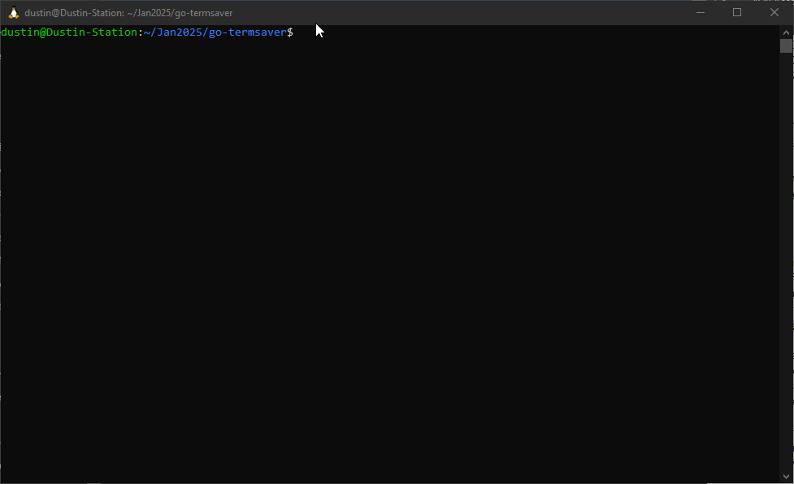

# TermSaver

The :computer: command line :computer: TUI :astonished: screensaver application :astonished: you never knew you needed!

## Features

### Animation
  - 60 FPS
  - bouncing ball
  - hardware/CPU simulated motion-blur

### Dynamic Resize
  - drag the corner of your terminal to resize and watch the screensaver (struggle to) re-render automatically in the new bounds!

### "Support" for any terminal!
  - definitely works pretty well on at least one

## DEMO

